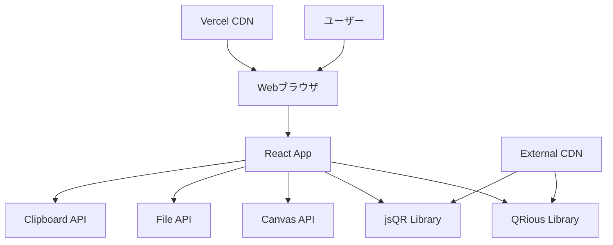

# QR Code Generator & Reader - 技術仕様書

**バージョン**: 1.0.0  
**作成日**: 2025年1月  
**最終更新**: 2025年1月  

## 📋 目次

1. [概要](#概要)
2. [システム要件](#システム要件)
3. [アーキテクチャ](#アーキテクチャ)
4. [機能仕様](#機能仕様)
5. [技術仕様](#技術仕様)
6. [API仕様](#api仕様)
7. [UI/UX仕様](#uiux仕様)
8. [パフォーマンス仕様](#パフォーマンス仕様)
9. [セキュリティ仕様](#セキュリティ仕様)
10. [品質要件](#品質要件)

---

## 🎯 概要

### プロジェクト名
QR Code Generator & Reader

### 目的
- ユーザーが簡単にQRコードを生成・解読できるWebアプリケーションの提供
- 多言語対応による国際的な利用者への対応
- 一括処理機能による業務効率化
- プライバシー重視のクライアントサイド処理

### スコープ
- **含まれる機能**: QRコード生成、解読、一括処理、多言語対応、PWA機能
- **含まれない機能**: ユーザー認証、データベース保存、サーバーサイド処理

---

## 💻 システム要件

### 対応ブラウザ
| ブラウザ | 最小バージョン | 推奨バージョン |
|---------|---------------|---------------|
| Chrome | 90+ | 最新版 |
| Firefox | 88+ | 最新版 |
| Safari | 14+ | 最新版 |
| Edge | 90+ | 最新版 |

### 対応デバイス
- **デスクトップ**: Windows, macOS, Linux
- **モバイル**: iOS 14+, Android 8+
- **タブレット**: iPad OS 14+, Android タブレット

### 最小システム要件
- **RAM**: 2GB以上
- **ストレージ**: 100MB（キャッシュ用）
- **ネットワーク**: 初回読み込み時のみ必要

---

## 🏗️ アーキテクチャ

### システム構成図



### 技術スタック

#### フロントエンド
```yaml
Framework: React 18.2.0
Styling: Tailwind CSS 3.x
Icons: Lucide React 0.263.1
Build Tool: Create React App 5.0.1
State Management: React Hooks (useState, useEffect, useRef)
```

#### QRコード処理
```yaml
生成ライブラリ: QRious 4.0.2
解読ライブラリ: jsQR 1.4.0
画像処理: HTML5 Canvas API
ファイル処理: HTML5 File API
```

#### デプロイ環境
```yaml
Platform: Vercel
CDN: Vercel Edge Network
SSL: 自動SSL証明書
Domain: Custom domain support
```

### ディレクトリ構造

```
qr-generator/
├── public/
│   ├── index.html          # メインHTMLファイル
│   ├── manifest.json       # PWA設定
│   └── favicon.ico         # アイコン
├── src/
│   ├── App.js              # メインコンポーネント
│   ├── App.css             # カスタムスタイル
│   └── index.js            # エントリーポイント
├── package.json            # 依存関係
├── vercel.json             # Vercel設定
├── tailwind.config.js      # Tailwind設定
├── postcss.config.js       # PostCSS設定
├── README.md               # ドキュメント
└── SPEC.md                 # 技術仕様書
```

---

## ⚙️ 機能仕様

### 1. QRコード生成機能

#### 1.1 URL生成
- **入力**: 任意のURL文字列
- **自動補完**: http://未入力時のhttps://自動追加
- **検証**: URL形式の簡易チェック
- **出力**: PNG形式のQRコード画像

#### 1.2 テキスト生成
- **入力**: 任意のテキスト（最大4,296文字）
- **文字コード**: UTF-8対応
- **改行対応**: マルチライン入力対応
- **出力**: PNG形式のQRコード画像

#### 1.3 連絡先生成（vCard）
- **対応フィールド**:
  - 姓・名（必須）
  - 電話番号
  - メールアドレス
  - 組織名
  - ウェブサイトURL
- **フォーマット**: vCard 3.0準拠
- **文字エンコーディング**: UTF-8

#### 1.4 スマイルロゴ埋め込み
- **ロゴサイズ**: QRコードサイズの13%
- **配置**: 中央配置
- **背景**: 白い円形背景（読み取り性向上）
- **エラー訂正レベル**: H（高）

### 2. QRコード解読機能

#### 2.1 ファイルアップロード
- **対応形式**: PNG, JPG, JPEG, GIF, WebP
- **最大ファイルサイズ**: 10MB
- **ドラッグ&ドロップ**: 対応
- **ファイル選択**: クリック選択対応

#### 2.2 画像処理
- **リサイズ**: 自動最適化
- **回転補正**: 自動検出・補正
- **コントラスト調整**: 読み取り精度向上

#### 2.3 結果表示
- **即座表示**: リアルタイム解読
- **エラーハンドリング**: 読み取り失敗時の適切なメッセージ
- **コピー機能**: ワンクリッククリップボードコピー

### 3. 一括処理機能

#### 3.1 CSV入力
- **フォーマット**: `ファイル名,内容`
- **区切り文字**: カンマ（,）
- **エンコーディング**: UTF-8
- **行数制限**: 100行（パフォーマンス考慮）

#### 3.2 一括生成
- **並列処理**: 非同期処理によるパフォーマンス最適化
- **プログレス表示**: 生成状況の可視化
- **プレビュー**: 生成前の内容確認

#### 3.3 ダウンロード
- **個別ダウンロード**: 各QRコードを個別保存
- **一括ダウンロード**: 連続ダウンロード（100ms間隔）
- **ファイル名**: ユーザー指定名.png

### 4. 多言語対応

#### 4.1 対応言語
- **日本語** (ja-JP): 完全対応
- **英語** (en-US): 完全対応
- **スペイン語** (es-ES): 完全対応

#### 4.2 言語検出
- **自動検出**: navigator.languages API使用
- **フォールバック**: 英語をデフォルト
- **リアルタイム切り替え**: ページリロード不要

---

## 🔧 技術仕様

### QRコード生成仕様

```javascript
// QRコード生成パラメータ
{
  size: 300,              // 画像サイズ（ピクセル）
  background: 'white',    // 背景色
  foreground: 'black',    // 前景色
  level: 'H',            // エラー訂正レベル（高）
  padding: 0,            // パディング
  format: 'png'          // 出力形式
}

// スマイルロゴ仕様
{
  emoji: '😊',           // 使用絵文字
  size: '13%',           // QRコードサイズ比
  background: 'white',   // 背景色
  padding: 2            // 背景パディング
}
```

### 画像処理仕様

```javascript
// Canvas設定
{
  maxWidth: 1920,        // 最大幅
  maxHeight: 1080,       // 最大高さ
  quality: 0.9,          // JPEG品質
  format: 'image/png'    // 出力形式
}

// ファイル読み込み
{
  maxSize: 10485760,     // 10MB
  allowedTypes: [
    'image/png',
    'image/jpeg',
    'image/jpg',
    'image/gif',
    'image/webp'
  ]
}
```

### ストレージ仕様

```javascript
// クライアントサイドストレージ（非使用）
localStorage: false,      // プライバシー保護
sessionStorage: false,    // プライバシー保護
indexedDB: false,        // プライバシー保護

// 一時データ（メモリ内のみ）
maxBatchSize: 100,       // 最大一括処理数
maxMemoryUsage: '100MB'  // 最大メモリ使用量
```

---

## 🌐 API仕様

### 外部CDN API

#### QRious Library
```javascript
// 読み込み
CDN: 'https://cdnjs.cloudflare.com/ajax/libs/qrious/4.0.2/qrious.min.js'
Version: '4.0.2'
License: 'MIT'
```

#### jsQR Library
```javascript
// 読み込み
CDN: 'https://cdnjs.cloudflare.com/ajax/libs/jsqr/1.4.0/jsQR.min.js'
Version: '1.4.0'
License: 'Apache-2.0'
```

### ブラウザAPI使用仕様

#### File API
```javascript
// ファイル読み込み
FileReader.readAsDataURL()
- 用途: 画像ファイル読み込み
- 対応形式: image/*
- エラーハンドリング: onerror対応
```

#### Canvas API
```javascript
// 画像描画・操作
getContext('2d')
- 用途: QRコード生成、画像処理
- 機能: 描画、テキスト描画、画像データ取得
```

#### Clipboard API
```javascript
// クリップボード操作
navigator.clipboard.writeText()
- 用途: テキストコピー
- フォールバック: document.execCommand
- 権限: 必要に応じてユーザー許可
```

---

## 🎨 UI/UX仕様

### デザインシステム

#### カラーパレット
```css
/* プライマリカラー */
--primary-50: #f0f9ff;
--primary-500: #6366f1;
--primary-600: #4f46e5;
--primary-700: #4338ca;

/* グレースケール */
--gray-50: #f9fafb;
--gray-100: #f3f4f6;
--gray-500: #6b7280;
--gray-600: #4b5563;
--gray-700: #374151;
--gray-800: #1f2937;

/* フィードバックカラー */
--success: #10b981;
--error: #ef4444;
--warning: #f59e0b;
```

#### タイポグラフィ
```css
/* フォントファミリー */
font-family: 'Inter', 'ui-sans-serif', 'system-ui', sans-serif;

/* フォントサイズ */
text-xs: 0.75rem;     /* 12px */
text-sm: 0.875rem;    /* 14px */
text-base: 1rem;      /* 16px */
text-lg: 1.125rem;    /* 18px */
text-xl: 1.25rem;     /* 20px */
text-2xl: 1.5rem;     /* 24px */
text-4xl: 2.25rem;    /* 36px */
```

#### スペーシング
```css
/* パディング・マージン */
p-1: 0.25rem;    /* 4px */
p-2: 0.5rem;     /* 8px */
p-3: 0.75rem;    /* 12px */
p-4: 1rem;       /* 16px */
p-6: 1.5rem;     /* 24px */
p-8: 2rem;       /* 32px */
```

### レスポンシブデザイン

#### ブレークポイント
```css
/* Tailwind CSS標準 */
sm: 640px    /* スマートフォン */
md: 768px    /* タブレット */
lg: 1024px   /* デスクトップ */
xl: 1280px   /* 大型デスクトップ */
```

#### グリッドシステム
```css
/* モバイルファースト */
.grid {
  grid-template-columns: 1fr;
}

/* タブレット以上 */
@media (min-width: 1024px) {
  .lg\:grid-cols-2 {
    grid-template-columns: repeat(2, 1fr);
  }
}
```

### アニメーション仕様

#### トランジション
```css
/* 基本トランジション */
transition-all: all 200ms ease-in-out;
transition-colors: color 200ms ease-in-out;

/* ホバーエフェクト */
hover:from-purple-700: /* グラデーション変化 */
hover:bg-gray-200:     /* 背景色変化 */
```

#### ローディングアニメーション
```css
/* スピナー */
@keyframes spin {
  from { transform: rotate(0deg); }
  to { transform: rotate(360deg); }
}

.animate-spin {
  animation: spin 1s linear infinite;
}
```

---

## ⚡ パフォーマンス仕様

### 読み込み性能

#### 初回読み込み
- **Target**: < 3秒（3G接続）
- **FCP (First Contentful Paint)**: < 1.5秒
- **LCP (Largest Contentful Paint)**: < 2.5秒
- **TTI (Time to Interactive)**: < 3秒

#### リソースサイズ
```yaml
HTML: < 5KB
CSS: < 50KB (Tailwind purged)
JavaScript: < 200KB (gzipped)
Total Bundle: < 250KB
External Libraries: < 100KB
```

### 実行時性能

#### QRコード生成
- **単一生成**: < 100ms
- **一括生成**: < 10秒（100個）
- **メモリ使用量**: < 100MB

#### QRコード解読
- **小画像 (<1MB)**: < 500ms
- **大画像 (<10MB)**: < 2秒
- **エラー率**: < 1%

### 最適化手法

#### コード分割
```javascript
// 動的インポート
const QRLibrary = () => import('qrious');
const JSQRLibrary = () => import('jsqr');
```

#### 画像最適化
```javascript
// Canvas最適化
context.imageSmoothingEnabled = false;
context.webkitImageSmoothingEnabled = false;
```

#### メモリ管理
```javascript
// リソース解放
canvas.width = 0;
canvas.height = 0;
context = null;
```

---

## 🔒 セキュリティ仕様

### データ保護

#### プライバシー設計
```yaml
Data Storage: None (client-side only)
Server Communication: None (after initial load)
User Tracking: None
Cookies: None
Analytics: None (optional)
```

#### 入力検証
```javascript
// XSS対策
const sanitizeInput = (input) => {
  return input.replace(/[<>'"]/g, '');
};

// ファイルサイズ制限
const MAX_FILE_SIZE = 10 * 1024 * 1024; // 10MB

// MIME タイプ検証
const ALLOWED_TYPES = [
  'image/png', 'image/jpeg', 'image/jpg', 
  'image/gif', 'image/webp'
];
```

### セキュリティヘッダー

#### CSP (Content Security Policy)
```http
Content-Security-Policy: 
  default-src 'self';
  script-src 'self' 'unsafe-inline' cdnjs.cloudflare.com;
  style-src 'self' 'unsafe-inline' cdn.tailwindcss.com;
  img-src 'self' data: blob:;
  connect-src 'self';
```

#### その他のセキュリティヘッダー
```http
X-Content-Type-Options: nosniff
X-Frame-Options: DENY
X-XSS-Protection: 1; mode=block
Referrer-Policy: strict-origin-when-cross-origin
```

### 脆弱性対策

#### 依存関係管理
```bash
# 定期的な脆弱性チェック
npm audit
npm audit fix

# 依存関係更新
npm update
```

#### HTTPS強制
```javascript
// Vercel自動SSL
if (location.protocol !== 'https:' && location.hostname !== 'localhost') {
  location.replace('https:' + window.location.href.substring(window.location.protocol.length));
}
```

---

## 🧪 品質要件

### テスト仕様

#### 単体テスト
```javascript
// Jest + React Testing Library
describe('QRCode Generation', () => {
  test('should generate QR code from URL', async () => {
    const result = await generateQRCode('https://example.com');
    expect(result).toBeDefined();
  });
});
```

#### 統合テスト
```javascript
// Cypress E2E
describe('QR Generator App', () => {
  it('should generate and download QR code', () => {
    cy.visit('/');
    cy.get('[data-testid=url-input]').type('https://example.com');
    cy.get('[data-testid=download-btn]').click();
    cy.readFile('cypress/downloads/qr-code-url.png').should('exist');
  });
});
```

#### アクセシビリティテスト
```javascript
// axe-core
describe('Accessibility', () => {
  test('should have no accessibility violations', async () => {
    const results = await axe(container);
    expect(results).toHaveNoViolations();
  });
});
```

### 品質メトリクス

#### コードカバレッジ
- **Target**: > 80%
- **Critical Path**: > 95%
- **Unit Tests**: > 90%

#### パフォーマンス
- **Lighthouse Score**: > 95
- **Web Vitals**: 全項目Good
- **Bundle Size**: < 250KB

#### 互換性
- **Browser Support**: > 95% global usage
- **Mobile Support**: iOS 14+, Android 8+
- **PWA Compliance**: 100%

---

## 🚀 デプロイ仕様

### ビルド設定

#### 環境変数
```bash
# 本番環境
REACT_APP_ENV=production
GENERATE_SOURCEMAP=false
BUILD_PATH=build

# 開発環境
REACT_APP_ENV=development
GENERATE_SOURCEMAP=true
```

#### ビルド最適化
```javascript
// package.json
{
  "scripts": {
    "build": "react-scripts build",
    "analyze": "npm run build && npx bundle-analyzer build/static/js/*.js"
  }
}
```

### Vercel設定

#### vercel.json
```json
{
  "version": 2,
  "builds": [
    {
      "src": "package.json",
      "use": "@vercel/static-build",
      "config": { "distDir": "build" }
    }
  ],
  "routes": [
    {
      "src": "/static/(.*)",
      "headers": { "cache-control": "public, max-age=31536000, immutable" }
    },
    { "src": "/(.*)", "dest": "/index.html" }
  ]
}
```

#### 環境別設定
```yaml
Production:
  Domain: qr-generator.vercel.app
  SSL: Auto-generated
  CDN: Vercel Edge Network
  Analytics: Vercel Analytics

Preview:
  Domain: qr-generator-{branch}.vercel.app
  SSL: Auto-generated
  Purpose: Pull request preview
```

---

## 📋 運用・保守

### モニタリング

#### エラー追跡
```javascript
// Error Boundary
class ErrorBoundary extends React.Component {
  componentDidCatch(error, errorInfo) {
    console.error('QR Generator Error:', error, errorInfo);
    // Error reporting service integration
  }
}
```

#### パフォーマンス監視
```javascript
// Web Vitals
import { getCLS, getFID, getFCP, getLCP, getTTFB } from 'web-vitals';

getCLS(console.log);
getFID(console.log);
getFCP(console.log);
getLCP(console.log);
getTTFB(console.log);
```

### 更新・メンテナンス

#### 依存関係更新
- **月次**: セキュリティ更新
- **四半期**: メジャーバージョン更新検討
- **年次**: 技術スタック見直し

#### 機能追加プロセス
1. **要件定義**: ユーザーフィードバック分析
2. **設計**: 技術仕様策定
3. **実装**: 機能開発・テスト
4. **リリース**: 段階的デプロイ

---

## 📚 参考資料

### 外部仕様
- [QR Code ISO/IEC 18004](https://www.iso.org/standard/62021.html)
- [vCard RFC 6350](https://tools.ietf.org/rfc/rfc6350.txt)
- [PWA Specification](https://web.dev/progressive-web-apps/)

### ライブラリドキュメント
- [QRious Documentation](https://github.com/neocotic/qrious)
- [jsQR Documentation](https://github.com/cozmo/jsQR)
- [React Documentation](https://reactjs.org/docs)
- [Tailwind CSS Documentation](https://tailwindcss.com/docs)

---

**作成者**: 開発チーム  
**承認者**: プロジェクトマネージャー  
**次回レビュー**: 2025年4月
